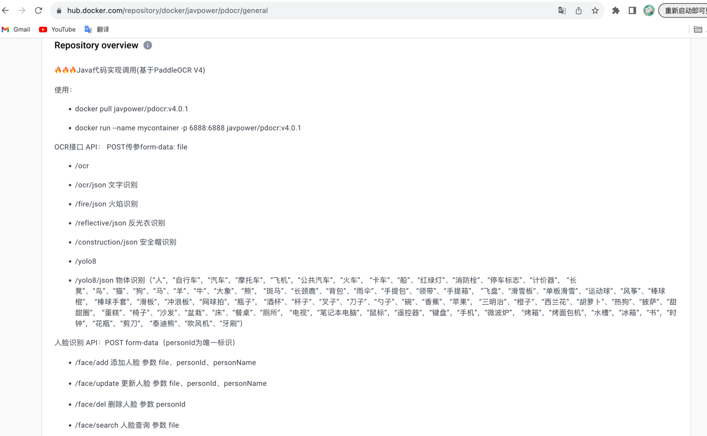

# JavaVision

## 🪧 项目起源

- JavaVision是一个基于Java开发的全能视觉智能识别项目。该项目起源于对图像处理和人工智能领域的热情，以及对Java作为主要编程语言的坚持。在AI领域，大多数解决方案都是使用Python实现的，因此决定充分利用Java的优势来构建一个功能强大且易于集成的视觉智能识别平台。

  >JavaVision是完全开源、免费并支持多平台部署视觉智能识别项目
  >如果该项目对您有帮助，您的star是我不断优化的动力！！！

## 👏 项目特点

JavaVision具有以下突出特点：

- 框架: SpringBoot

- 多功能性：JavaVision不仅支持OCR接口、YoloV8物体识别、人脸识别等核心功能，还可以轻松扩展到其他领域，如语音识别、动物识别、安防检查等。这使得JavaVision成为一个全面解决多种场景需求的自适应平台。

- 高性能：JavaVision经过精心优化，具备卓越的性能表现。通过巧妙地结合算法优化和多线程技术，JavaVision能够在短时间内处理大量复杂的图像数据，并快速准确地进行识别和分析。

- 可靠稳定：Java作为一种成熟而可靠的编程语言，具备出色的稳定性和安全性。JavaVision严格遵循最佳实践和高标准，确保项目的稳定运行，并提供可靠的数据保护和隐私保密。

- 易于集成：JavaVision提供简洁而强大的API接口，使得与其他系统和平台的集成变得轻松快捷。无论是嵌入到现有应用程序中，还是作为独立的服务进行部署，JavaVision都能够与各种技术栈和框架无缝衔接。

- 灵活可拓展：JavaVision采用模块化设计，允许用户根据自己的需求进行灵活的定制和扩展。用户可以根据项目需求选择合适的功能模块，也可以通过插件机制添加新的识别算法和特性。

  > JavaVision旨在为Java开发者提供一个全面的视觉智能识别解决方案，让他们能够以熟悉且喜爱的编程语言构建出先进、可靠且易于集成的AI应用。无论是企业级应用还是个人项目，JavaVision都能助力开发者实现更多可能性

## 🔝 进阶使用

docker一键部署

- docker pull javpower/pdocr:v4.0.1
- docker run --name mycontainer -p 6888:6888 javpower/pdocr:v4.0.1

>   

## 鸣谢

- [RapidOcr-Java](https://github.com/MyMonsterCat/RapidOcr-Java)
- [RapidOCR](https://github.com/RapidAI/RapidOCR)
- [PaddleOCR](https://github.com/PaddlePaddle/PaddleOCR)
- [AIAS](https://gitee.com/mymagicpower/AIAS)

## 🔝 项目API

### 一、OCR应用

#### 1、YOLOV8识别物体

**接口地址**:`/yolo8`

**请求方式**:`POST`


**请求数据类型**:`multipart/form-data`


**响应数据类型**:`*/*`


**接口描述**:


**请求参数**:


| 参数名称 | 参数说明 | 请求类型 | 是否必须 | 数据类型 | schema |
| -------- | -------- | -------- | -------- | -------- | ------ |
| file     |          | query    | true     | file     |        |


**响应状态**:


| 状态码 | 说明 | schema |
| ------ | ---- | ------ |
| 200    | OK   |        |


**响应参数**:


暂无


**响应示例**:

```javascript
{
    "code": 500,
    "success": false,
    "msg": "java.io.FileNotFoundException: /opt/ocr/20231109151816332402394.png (No such file or directory)",
    "data": null,
    "time": "2023-11-09 15:18:16",
    "traceId": null
}
```

#### 2、YOLOV8识别物体


**接口地址**:`/yolo8/json`


**请求方式**:`POST`


**请求数据类型**:`multipart/form-data`


**响应数据类型**:`*/*`


**接口描述**:


**请求参数**:


| 参数名称 | 参数说明 | 请求类型 | 是否必须 | 数据类型 | schema |
| -------- | -------- | -------- | -------- | -------- | ------ |
| file     |          | query    | true     | file     |        |


**响应状态**:


| 状态码 | 说明 | schema    |
| ------ | ---- | --------- |
| 200    | OK   | Detection |


**响应参数**:


| 参数名称   | 参数说明 | 类型           | schema         |
| ---------- | -------- | -------------- | -------------- |
| label      |          | string         |                |
| clsId      |          | integer(int32) | integer(int32) |
| bbox       |          | array          |                |
| confidence |          | number(float)  | number(float)  |


**响应示例**:

```javascript
[
	{
		"label": "",
		"clsId": 0,
		"bbox": [],
		"confidence": 0
	}
]
```

#### 3、DJL识别文字


**接口地址**:`/word`


**请求方式**:`POST`


**请求数据类型**:`multipart/form-data`


**响应数据类型**:`*/*`


**接口描述**:


**请求参数**:


| 参数名称 | 参数说明 | 请求类型 | 是否必须 | 数据类型 | schema |
| -------- | -------- | -------- | -------- | -------- | ------ |
| file     |          | query    | true     | file     |        |


**响应状态**:


| 状态码 | 说明 | schema |
| ------ | ---- | ------ |
| 200    | OK   |        |


**响应参数**:


暂无


**响应示例**:

```javascript

```

#### 4、DJL识别文字


**接口地址**:`/word/json`


**请求方式**:`POST`


**请求数据类型**:`multipart/form-data`


**响应数据类型**:`*/*`


**接口描述**:


**请求参数**:


| 参数名称 | 参数说明 | 请求类型 | 是否必须 | 数据类型 | schema |
| -------- | -------- | -------- | -------- | -------- | ------ |
| file     |          | query    | true     | file     |        |


**响应状态**:


| 状态码 | 说明 | schema    |
| ------ | ---- | --------- |
| 200    | OK   | WordBlock |


**响应参数**:


| 参数名称      | 参数说明 | 类型           | schema |
| ------------- | -------- | -------------- | ------ |
| text          |          | string         |        |
| charScores    |          | array          |        |
| boxPoint      |          | array          | Point  |
| &emsp;&emsp;x |          | number(double) |        |
| &emsp;&emsp;y |          | number(double) |        |


**响应示例**:

```javascript
[
	{
		"text": "",
		"charScores": [],
		"boxPoint": [
			{
				"x": 0,
				"y": 0
			}
		]
	}
]
```

#### 5、反光衣检测


**接口地址**:`/reflective/json`


**请求方式**:`POST`


**请求数据类型**:`multipart/form-data`


**响应数据类型**:`*/*`


**接口描述**:

**请求参数**:


| 参数名称 | 参数说明 | 请求类型 | 是否必须 | 数据类型 | schema |
| -------- | -------- | -------- | -------- | -------- | ------ |
| file     |          | query    | true     | file     |        |


**响应状态**:


| 状态码 | 说明 | schema |
| ------ | ---- | ------ |
| 200    | OK   |        |


**响应参数**:


暂无


**响应示例**:

```javascript

```

#### 6、JNI识别文字


**接口地址**:`/ocr`


**请求方式**:`POST`


**请求数据类型**:`multipart/form-data`


**响应数据类型**:`*/*`


**接口描述**:


**请求参数**:


| 参数名称               | 参数说明 | 请求类型 | 是否必须 | 数据类型 | schema   |
| ---------------------- | -------- | -------- | -------- | -------- | -------- |
| param                  |          | query    | true     | OcrParam | OcrParam |
| &emsp;&emsp;openAi-key |          |          | false    | string   |          |
| &emsp;&emsp;描述词     |          |          | false    | array    | string   |
| file                   |          | query    | true     | file     |          |


**响应状态**:


| 状态码 | 说明 | schema |
| ------ | ---- | ------ |
| 200    | OK   |        |


**响应参数**:


暂无


**响应示例**:

```javascript

```

#### 7、JNI识别文字


**接口地址**:`/ocr/json`


**请求方式**:`POST`


**请求数据类型**:`multipart/form-data`


**响应数据类型**:`*/*`


**接口描述**:


**请求参数**:


| 参数名称 | 参数说明 | 请求类型 | 是否必须 | 数据类型 | schema |
| -------- | -------- | -------- | -------- | -------- | ------ |
| file     |          | query    | true     | file     |        |


**响应状态**:


| 状态码 | 说明 | schema    |
| ------ | ---- | --------- |
| 200    | OK   | TextBlock |


**响应参数**:


| 参数名称      | 参数说明 | 类型           | schema         |
| ------------- | -------- | -------------- | -------------- |
| boxPoint      |          | array          | Point          |
| &emsp;&emsp;x |          | number(double) |                |
| &emsp;&emsp;y |          | number(double) |                |
| boxScore      |          | number(float)  | number(float)  |
| angleIndex    |          | integer(int32) | integer(int32) |
| angleScore    |          | number(float)  | number(float)  |
| angleTime     |          | number(double) | number(double) |
| text          |          | string         |                |
| charScores    |          | array          |                |
| crnnTime      |          | number(double) | number(double) |
| blockTime     |          | number(double) | number(double) |


**响应示例**:

```javascript
[
	{
		"boxPoint": [
			{
				"x": 0,
				"y": 0
			}
		],
		"boxScore": 0,
		"angleIndex": 0,
		"angleScore": 0,
		"angleTime": 0,
		"text": "",
		"charScores": [],
		"crnnTime": 0,
		"blockTime": 0
	}
]
```

#### 8、火焰检测


**接口地址**:`/fire/json`


**请求方式**:`POST`


**请求数据类型**:`multipart/form-data`


**响应数据类型**:`*/*`


**接口描述**:


**请求参数**:


| 参数名称 | 参数说明 | 请求类型 | 是否必须 | 数据类型 | schema |
| -------- | -------- | -------- | -------- | -------- | ------ |
| file     |          | query    | true     | file     |        |


**响应状态**:


| 状态码 | 说明 | schema |
| ------ | ---- | ------ |
| 200    | OK   |        |


**响应参数**:


暂无


**响应示例**:

```javascript

```

#### 9、安全帽检测


**接口地址**:`/construction/json`


**请求方式**:`POST`


**请求数据类型**:`multipart/form-data`


**响应数据类型**:`*/*`


**接口描述**:


**请求参数**:


| 参数名称 | 参数说明 | 请求类型 | 是否必须 | 数据类型 | schema |
| -------- | -------- | -------- | -------- | -------- | ------ |
| file     |          | query    | true     | file     |        |


**响应状态**:


| 状态码 | 说明 | schema |
| ------ | ---- | ------ |
| 200    | OK   |        |


**响应参数**:


暂无


**响应示例**:

```javascript

```

### 二、人脸应用

#### 1、更新人脸


**接口地址**:`/face/update`


**请求方式**:`POST`


**请求数据类型**:`multipart/form-data`


**响应数据类型**:`*/*`


**接口描述**:


**请求参数**:


| 参数名称                 | 参数说明 | 请求类型 | 是否必须 | 数据类型  | schema    |
| ------------------------ | -------- | -------- | -------- | --------- | --------- |
| param                    |          | query    | true     | FaceParam | FaceParam |
| &emsp;&emsp;人员唯一标识 |          |          | true     | string    |           |
| &emsp;&emsp;人员名称     |          |          | true     | string    |           |
| file                     |          | query    | true     | file      |           |


**响应状态**:


| 状态码 | 说明 | schema |
| ------ | ---- | ------ |
| 200    | OK   |        |


**响应参数**:


暂无


**响应示例**:

```javascript

```

#### 2、人脸查询


**接口地址**:`/face/search`


**请求方式**:`POST`


**请求数据类型**:`multipart/form-data`


**响应数据类型**:`*/*`


**接口描述**:


**请求参数**:


| 参数名称 | 参数说明 | 请求类型 | 是否必须 | 数据类型 | schema |
| -------- | -------- | -------- | -------- | -------- | ------ |
| file     |          | query    | true     | file     |        |


**响应状态**:


| 状态码 | 说明 | schema       |
| ------ | ---- | ------------ |
| 200    | OK   | PersonObject |


**响应参数**:


| 参数名称   | 参数说明 | 类型   | schema |
| ---------- | -------- | ------ | ------ |
| personId   |          | string |        |
| personName |          | string |        |


**响应示例**:

```javascript
{
	"personId": "",
	"personName": ""
}
```

#### 3、删除人脸


**接口地址**:`/face/del`


**请求方式**:`POST`


**请求数据类型**:`application/x-www-form-urlencoded`


**响应数据类型**:`*/*`


**接口描述**:


**请求参数**:


| 参数名称                 | 参数说明 | 请求类型 | 是否必须 | 数据类型  | schema    |
| ------------------------ | -------- | -------- | -------- | --------- | --------- |
| param                    |          | query    | true     | FaceParam | FaceParam |
| &emsp;&emsp;人员唯一标识 |          |          | true     | string    |           |


**响应状态**:


| 状态码 | 说明 | schema |
| ------ | ---- | ------ |
| 200    | OK   |        |


**响应参数**:


暂无


**响应示例**:

```javascript

```


> #### 4、添加人脸


**接口地址**:`/face/add`


**请求方式**:`POST`


**请求数据类型**:`multipart/form-data`


**响应数据类型**:`*/*`


**接口描述**:


**请求参数**:


| 参数名称                 | 参数说明 | 请求类型 | 是否必须 | 数据类型  | schema    |
| ------------------------ | -------- | -------- | -------- | --------- | --------- |
| param                    |          | query    | true     | FaceParam | FaceParam |
| &emsp;&emsp;人员唯一标识 |          |          | true     | string    |           |
| &emsp;&emsp;人员名称     |          |          | true     | string    |           |
| file                     |          | query    | true     | file      |           |


**响应状态**:


| 状态码 | 说明 | schema |
| ------ | ---- | ------ |
| 200    | OK   |        |


**响应参数**:


暂无


**响应示例**:

```javascript

```


## 开源许可

使用 [Apache License 2.0](https://gitee.com/giteeClass/java-vision/raw/master/LICENSE)